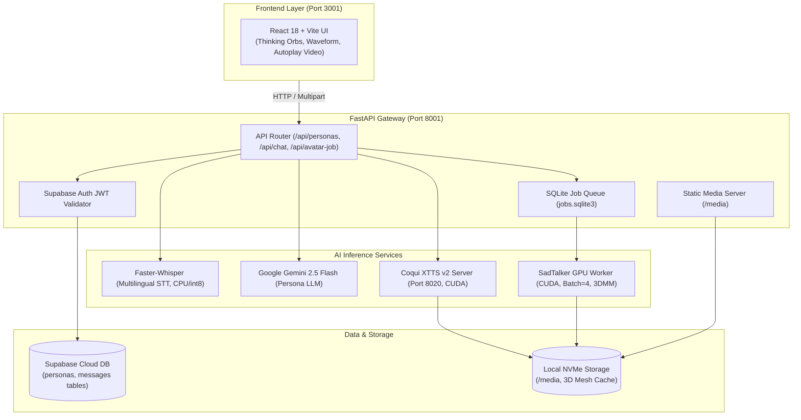

# Pratibimb (प्रतिबिंब) — Multimodal AI Digital Twin Platform

[](https://fastapi.tiangolo.com)
[](https://react.dev)
[](https://vitejs.dev)
[](https://pytorch.org)
[](https://deepmind.google/technologies/gemini/)
[](https://supabase.com)
[](LICENSE)

> **Pratibimb** *(Hindi: प्रतिबिंब — "Reflection")* is a full-stack, multimodal AI platform that allows users to create, customize, and converse with persistent **AI Digital Twins**. It combines character persona prompting, zero-shot acoustic voice cloning, and audio-driven 3D lip-synced video avatars into a seamless, real-time experience.

---

## 🌟 Key Features

- 🎭 **Persona Creation & Identity Enrollment**: Upload any portrait photo and a 5–15 second voice snippet (`.wav`/`.mp3`) along with personality parameters (Tone, Humor, Style, Bio) to create a custom digital replica.
- 💬 **Multilingual Conversational Intelligence**: Real-time context-aware dialogue powered by **Google Gemini 2.5 Flash** with custom prompt injection for authentic character consistency.
- 🎙️ **Zero-Shot Voice Cloning (Coqui XTTS v2)**: Replicates the unique vocal acoustics, cadence, and tone of any persona from a single short audio sample with ~1.5s inference latency.
- 🎥 **Audio-Driven 3D Lip-Synced Video (SadTalker)**: Generates 1:1 square talking-head avatar videos synced to the synthesized voice with automatic 3D facial mesh caching for instant repeat generations.
- 🗣️ **Multilingual Speech-to-Text (Faster-Whisper)**: Instant voice transcription supporting English, Hindi, Bengali, and other Indic languages with pre-warmed multilingual prompt tuning.
- ⚡ **Warm In-Memory GPU Architecture**: Independent background daemon workers keep AI model weights loaded in VRAM, eliminating multi-minute cold starts.
- ✨ **Futuristic Glassmorphic UI**: Interactive interface featuring **Thinking Orbs**, **Voice Glow** visualizers, fluid particle backgrounds, and native autoplay video chat bubbles.

---

## 🏛️ System Architecture



---

## 🕹️ The 3 Interaction Modes

| Mode | Icon | Description | Core Engine |
| :--- | :---: | :--- | :--- |
| **Text Mode** | 💬 | Real-time chat dialogue reflecting the persona's humor, tone, and knowledge base. | Google Gemini 2.5 Flash |
| **Voice Mode** | 🎙️ | Conversational speech with zero-shot voice cloning and interactive waveform audio playback. | Faster-Whisper + Gemini + Coqui XTTS v2 |
| **Video Mode** | 🎥 | Full audiovisual talking-head video with lip-sync, subtle facial motion, and direct autoplay. | XTTS v2 + SadTalker 3DMM (CUDA) |

---

## 📂 Project Structure

```
Pratibimb/
├── backend/
│   ├── app/
│   │   ├── auth.py             # Supabase JWT token verification
│   │   ├── config.py           # Environment variables and path resolution
│   │   ├── gemini_service.py   # Persona prompt assembly & Gemini API client
│   │   ├── jobs.py             # SQLite queue manager for video render jobs
│   │   ├── main.py             # FastAPI entrypoint, endpoints, and CORS
│   │   ├── tts_service.py      # XTTS warm server orchestrator & HTTP client
│   │   └── worker.py           # Persistent supervisor for SadTalker worker
│   ├── sadtalker_worker.py     # GPU-accelerated SadTalker worker with mesh caching
│   ├── xtts_server.py          # Dedicated standalone FastAPI server for XTTS v2
│   ├── schema.sql              # Supabase SQL schema for personas & messages
│   ├── requirements.txt        # Python backend dependencies
│   └── .env.example            # Environment variable template for backend
│
├── frontend/
│   ├── public/                 # Favicons, vector icons, and static assets
│   ├── src/
│   │   ├── assets/             # Logos, hero images, and branding assets
│   │   ├── lib/
│   │   │   ├── config.js       # Backend API URL configuration
│   │   │   └── supabase.js     # Supabase client initialization
│   │   ├── App.jsx             # Main dashboard, persona selector, and routing
│   │   ├── App.module.css      # Dark glassmorphism dashboard styles
│   │   ├── AuthPage.jsx        # Login & signup with Supabase Auth
│   │   ├── ChatPage.jsx        # Chat interface with Text, Voice, and Video tabs
│   │   ├── ChatPage.module.css # Bubble styles, 1:1 video frame, and waveform
│   │   ├── CreatePersonaModal.jsx # Persona creation & edit modal
│   │   ├── SearchBar.jsx       # Floating search & input bar with voice recorder
│   │   └── main.jsx            # React root mount
│   ├── package.json            # Node.js dependencies and scripts
│   ├── vite.config.js          # Vite configuration (port 3001)
│   └── .env.example            # Environment variable template for frontend
│
├── .gitignore                  # Git ignore rules for node_modules, .venv, media, and secrets
├── README.md                   # Project documentation
├── SETUP.md                    # Environment installation guide
└── WORKFLOW.md                 # Complete architectural sequence diagrams
```

---

## ⚡ Performance Optimizations

1. **Persistent 3D Face Mesh Caching**:
   - The first time an avatar photo is processed, its 3DMM landmark geometry (`coeff.mat`, `crop.png`, `crop_info.pkl`) is cached locally. All future video generations for that persona reuse this cache, saving **15–25 seconds per request**.
2. **Direct `uint8` Frame Streaming**:
   - Video frames are converted directly to 8-bit unsigned integer arrays on the GPU (`np.clip(img * 255.0, 0, 255).astype(np.uint8)`), reducing RAM consumption by **75%** and preventing OOM errors on long speeches.
3. **Warm In-Memory GPU Workers**:
   - XTTS v2 and SadTalker remain loaded in GPU VRAM across requests, avoiding multi-minute cold starts on every interaction.
4. **Zero-Latency Local SQLite Polling**:
   - Video job status is polled directly from a lightweight local SQLite database, avoiding remote cloud roundtrips and rate limits during rendering.

---

## 🚀 Getting Started

### 1. Prerequisites

- **OS**: Windows 10 / 11 (or Linux with CUDA)
- **GPU**: NVIDIA GPU with 4GB+ VRAM (RTX 3050, 3060, 4060 or higher recommended)
- **Software**:
  - Python 3.10+
  - Node.js 18+ and npm
  - [FFmpeg](https://ffmpeg.org/download.html) (added to System PATH)
  - [Anaconda / Miniconda](https://docs.anaconda.com/miniconda/)
  - [Supabase](https://supabase.com) account (free tier)

---

### 2. Environment Configuration

#### Backend Configuration (`backend/.env`)
Create `backend/.env` based on `backend/.env.example`:

```env
SUPABASE_URL=https://your-project.supabase.co
SUPABASE_ANON_KEY=your_supabase_anon_key
SUPABASE_SERVICE_ROLE_KEY=your_supabase_service_role_key
GEMINI_API_KEY=your_gemini_api_key
FFMPEG_BIN=C:\path\to\ffmpeg.exe
SADTALKER_DIR=D:\path\to\SadTalker
SADTALKER_CHECKPOINTS=D:\path\to\SadTalker\checkpoints
TTS_HOME=D:\models\tts
```

#### Frontend Configuration (`frontend/.env`)
Create `frontend/.env` based on `frontend/.env.example`:

```env
VITE_SUPABASE_URL=https://your-project.supabase.co
VITE_SUPABASE_ANON_KEY=your_supabase_anon_key
VITE_API_URL=http://127.0.0.1:8001
```

---

### 3. Database Setup (Supabase)

Execute the SQL script in [backend/schema.sql](file:///d:/My%20Project/PersonaTwin-E2E/backend/schema.sql) in your **Supabase SQL Editor**:

```sql
-- Creates personas table
create table public.personas (
  id uuid primary key default gen_random_uuid(),
  user_id uuid references auth.users not null,
  name text not null,
  tone text default 'casual',
  style text default 'friendly, concise',
  humor text default 'light',
  notes text,
  photo_path text,
  voice_path text,
  created_at timestamp with time zone default now()
);

-- Creates messages table
create table public.messages (
  id uuid primary key default gen_random_uuid(),
  persona_id uuid references public.personas on delete cascade not null,
  user_id uuid references auth.users not null,
  role text not null,
  content text not null,
  created_at timestamp with time zone default now()
);
```

---

## 🏃 Running the System

Open **4 separate PowerShell terminal tabs** and launch the components:

### Tab 1: XTTS v2 Voice Server (Port 8020)
```powershell
D:\Anaconda\envs\xtts\python.exe "D:\My Project\PersonaTwin-E2E\backend\app\tts_service.py"
```

### Tab 2: SadTalker Warm Video Worker
```powershell
cd "D:\My Project\PersonaTwin-E2E\backend"
.\.venv\Scripts\python.exe -m app.worker
```

### Tab 3: FastAPI Backend Gateway (Port 8001)
```powershell
cd "D:\My Project\PersonaTwin-E2E\backend"
.\.venv\Scripts\python.exe -m uvicorn app.main:app --host 127.0.0.1 --port 8001 --reload
```

### Tab 4: Frontend Application (Port 3001)
```powershell
cd "D:\My Project\PersonaTwin-E2E\frontend"
npm run dev
```

Visit **`http://localhost:3001`** in your browser to start interacting with your digital twins!

---

## 📡 REST API Reference

| Method | Endpoint | Description |
| :--- | :--- | :--- |
| `GET` | `/health` | Health check for backend API gateway |
| `GET` | `/api/personas` | List all personas created by authenticated user |
| `POST` | `/api/personas` | Create new persona with photo & voice sample upload |
| `PUT` | `/api/personas/{id}` | Update persona attributes (tone, style, humor, notes) |
| `GET` | `/api/personas/{id}/messages` | Retrieve chronological chat history for persona |
| `POST` | `/api/transcribe` | Transcribe voice recording using Faster-Whisper |
| `POST` | `/api/chat` | Send message $\rightarrow$ returns Gemini reply + cloned audio URL |
| `POST` | `/api/avatar-job` | Enqueue a SadTalker lip-synced video rendering job |
| `GET` | `/api/jobs/{job_id}` | Check status of avatar video job (`queued`/`running`/`completed`) |
| `GET` | `/media/{file_path}` | Stream static media files (photos, audio, generated videos) |

---

## 📜 Acknowledgments & Open Source Credits

- **[Google DeepMind Gemini](https://deepmind.google/technologies/gemini/)**: Conversational LLM reasoning.
- **[Coqui XTTS v2](https://github.com/coqui-ai/TTS)**: Zero-shot acoustic voice cloning.
- **[SadTalker](https://github.com/OpenTalker/SadTalker)**: Audio-driven 3D facial animation.
- **[Faster-Whisper](https://github.com/SYSTRAN/faster-whisper)**: Fast, memory-efficient speech recognition.
- **[FastAPI](https://fastapi.tiangolo.com/)**: Asynchronous Python backend framework.
- **[Supabase](https://supabase.com/)**: Cloud authentication & database.
- **[Vite](https://vitejs.dev/) & [React](https://react.dev/)**: Modern frontend runtime.

---

## 📄 License

This project is licensed under the [MIT License](LICENSE).
