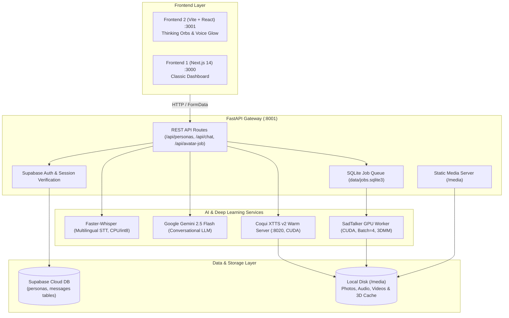
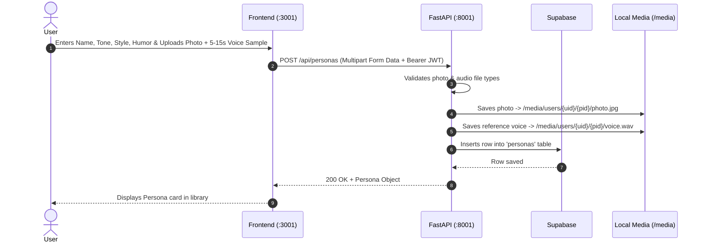
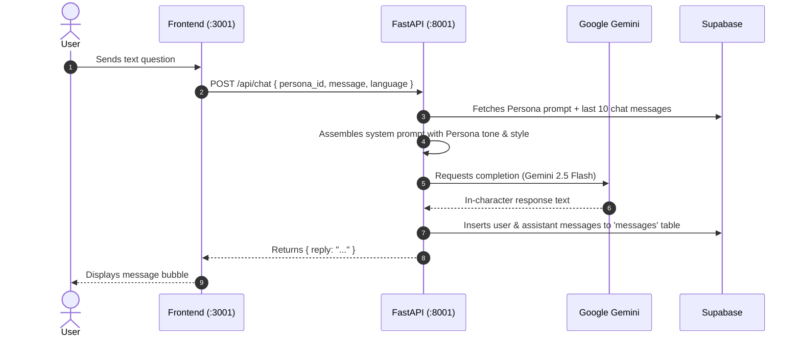
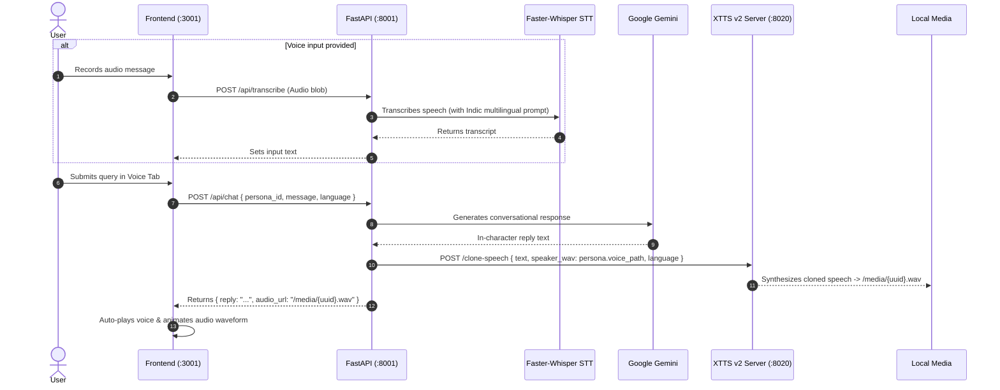
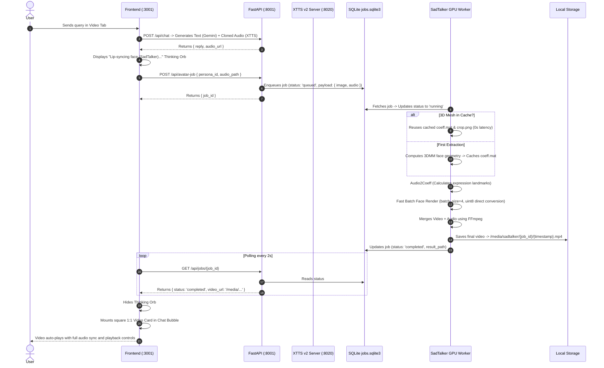

# PersonaTwin E2E — Complete System Workflow

**PersonaTwin** is an end-to-end multimodal AI platform that creates persistent, conversational **Digital Twins** featuring personality prompting, zero-shot acoustic voice cloning, and audio-driven lip-synced talking avatars.

---

## 1. High-Level Architecture Diagram



---

## 2. Component & Port Map

| Component | Port | Technology | Purpose |
| :--- | :--- | :--- | :--- |
| **Frontend 2 (Modern)** | `http://localhost:3001` | React 18, Vite, Lucide Icons, Thinking Orbs | Real-time chat interface with dynamic thinking orbs, voice waves, and autoplay video cards |
| **Frontend 1 (Classic)** | `http://localhost:3000` | Next.js 14, TailwindCSS | Legacy management dashboard |
| **API Gateway** | `http://127.0.0.1:8001` | FastAPI, Uvicorn, Python 3.10 | Authenticates requests, coordinates LLM/TTS/STT, and manages job queues |
| **XTTS v2 Warm Engine** | `http://127.0.0.1:8020` | Coqui XTTS v2, PyTorch (CUDA) | Keeps acoustic voice cloning model warm in VRAM for instant speech generation (~1.5s) |
| **SadTalker GPU Worker** | Background Worker | Conda (`sadtalker` env, CUDA) | Polls SQLite queue, renders lip-synced face videos with batch processing & 3D face mesh cache |
| **Speech-to-Text (STT)** | Embedded | Faster-Whisper (`small` model) | Transcribes voice inputs for English, Hindi, Bengali, etc. |
| **Cloud Database** | Cloud REST | Supabase (PostgreSQL) | Stores user profiles, persona configs, and historical chats |

---

## 3. Detailed End-to-End Workflows

### Workflow 1: Persona Creation & Identity Enrollment



---

### Workflow 2: Text Chat Mode (💬)



---

### Workflow 3: Voice Mode (🎙️ XTTS v2 Zero-Shot Voice Cloning)



---

### Workflow 4: Video Avatar Mode (🎥 SadTalker 3D Lip-Sync)



---

## 4. Performance Optimizations Implemented

1. **Persistent 3D Face Mesh Caching**:
   - The 3D facial landmarks (`coeff.mat`, `crop.png`, `crop_info.pkl`) are cached inside `backend/media/users/.../sadtalker_cache/`. Every subsequent generation reuses the cache, skipping 15–25 seconds of face parsing.
2. **Direct `uint8` Frame Streaming**:
   - Frame arrays are converted directly to 8-bit unsigned integers on the fly (`np.clip(img * 255.0, 0, 255).astype(np.uint8)`), reducing RAM consumption by 75% and preventing out-of-memory errors on long speeches.
3. **Warm GPU Services**:
   - Both XTTS v2 and SadTalker remain loaded in GPU memory to eliminate per-request cold starts.
4. **Zero-Latency Polling**:
   - Status polling operates directly against local SQLite with no remote network bottlenecks.

---

## 5. API Reference Guide

| Endpoint | Method | Headers | Request Body / Query | Description |
| :--- | :--- | :--- | :--- | :--- |
| `/api/personas` | `GET` | `Authorization: Bearer <token>` | None | Returns all personas created by the authenticated user |
| `/api/personas` | `POST` | `Authorization: Bearer <token>` | `multipart/form-data` (`name`, `photo`, `voice_sample`, `tone`, `style`, `humor`, `notes`) | Creates a new persona with enrolled voice & photo |
| `/api/personas/{id}` | `PUT` | `Authorization: Bearer <token>` | `multipart/form-data` (`name`, `tone`, `style`, etc.) | Updates persona details |
| `/api/personas/{id}/messages` | `GET` | `Authorization: Bearer <token>` | None | Retrieves conversation history |
| `/api/transcribe` | `POST` | `Authorization: Bearer <token>` | `multipart/form-data` (`audio`, `language`) | Faster-Whisper audio transcription |
| `/api/chat` | `POST` | `Authorization: Bearer <token>` | JSON (`persona_id`, `message`, `language`) | Generates Gemini reply + XTTS v2 cloned speech audio |
| `/api/avatar-job` | `POST` | `Authorization: Bearer <token>` | `multipart/form-data` (`persona_id`, `audio_path`) | Enqueues a SadTalker video lip-sync job |
| `/api/jobs/{job_id}` | `GET` | None | None | Checks status of a video rendering job |
| `/media/{path}` | `GET` | None | None | Streams static media (audio, video, photos) |

---

## 6. How to Run the Entire System

Open 4 PowerShell terminal tabs in Windows:

### Terminal 1: XTTS v2 Voice Server
```powershell
D:\Anaconda\envs\xtts\python.exe "D:\My Project\PersonaTwin-E2E\backend\app\tts_service.py"
```

### Terminal 2: SadTalker Warm Video Worker
```powershell
cd "D:\My Project\PersonaTwin-E2E\backend"
.\.venv\Scripts\python.exe -m app.worker
```

### Terminal 3: FastAPI Backend
```powershell
cd "D:\My Project\PersonaTwin-E2E\backend"
.\.venv\Scripts\python.exe -m uvicorn app.main:app --host 127.0.0.1 --port 8001 --reload
```

### Terminal 4: Frontend Application
```powershell
cd "D:\My Project\PersonaTwin-E2E\frontend"
npm run dev
```

Open your browser at: **`http://localhost:3001`**
